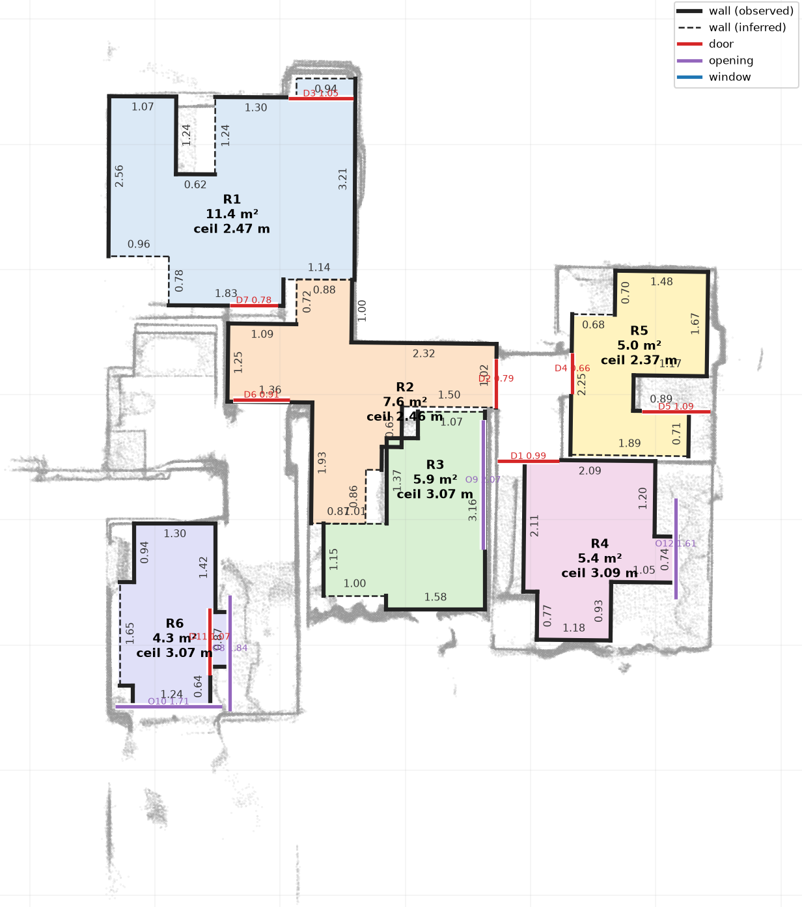

# Phone capture to dimensioned floor plan: technical report

<!-- Numbers marked {{...}} are filled from bench/ when the last runs land. -->

## 1. What runs, and what the numbers are

`python -m ysplan <capture>` turns one phone capture into `plan.json` and `plan.png`. The
output covers rooms, walls, ceiling heights, floor areas, openings, adjacency, damage regions,
concealed-damage flags and scope items, each measurement with a 95% interval, in the schema of
`docs/plan.schema.json`. The tier is picked from what the capture contains. The capture route
is Route 2: the free Stray Scanner app for LiDAR, the stock Camera app for video and photos,
and a one-page protocol (`docs/capture_protocol.md`).

No laser ground truth exists for the three supplied captures, and no hardware was available to
make any. Every accuracy number is therefore a consistency number: two captures of the same
room, two interleaved halves of one capture, a short cut of a capture against the full one, or
a lower tier against LiDAR. Consistency is necessary for accuracy but not sufficient; a bias
both measurements share is invisible to it. `docs/benchmark_report.md` has every table.

## 2. Architecture (LiDAR tier)

| Stage | What it does | Why this way |
|---|---|---|
| Load | Stray Scanner folder or .zip, current and older export | The walk-in device and app version are unknown |
| Drift | 3 s chunks; loop edges by point-to-plane ICP restricted to yaw and translation; pose graph | ARKit gravity is reliable, heading and position drift are not; 4 degrees of freedom keep it well conditioned |
| Fuse | Depth with ARKit confidence 2 into 2 cm voxels with at least 3 hits | Removes flying pixels and most mirror and glass ghosts |
| Floor, axes | Floor = lowest surface covering 2 m² at least 1.1 m below the camera, else "not seen"; Manhattan heading from wall points | A silently wrong floor ruins every height (found by the walk-in rehearsal) |
| Rooms | 2D ray carving (a ray that ends on the floor or ceiling proves the space it crossed is empty), doorways closed, watershed | Free space is observed directly, not inferred from walls that furniture hides |
| Outlines | Rectilinear polygon over a cell complex of detected wall lines | Every edge lies on a measured wall line |
| Walls | Each room squared on its own; each face = median of its points within 5 cm | Fix loop round 1 |
| Ceilings | Robust ceiling level minus this room's own floor level | Fix loop round 3 |
| Openings | Gaps in solid wall along every wall line, proven open by rays; jambs per height slice | Fix loop round 5 |
| Damage | Surfaces unwrapped at 1 cm per pixel; pluggable detector; masks to m²; rules CD1 to CD5; scope keyed to surface ids | Metric extent comes from the geometry, not from the detector |

The video tier makes a depth map for every 40th frame (MapAnything, given the ARKit poses
and intrinsics, so the depth is metric and consistent across views) and then runs the same
geometry stages. The photo tier is described in section 3.

<figure><figcaption>Figure 1. LiDAR-tier plan of the
ceiling capture (215 s walk, one command, no settings): six rooms placed in one frame with wall
lengths, floor areas, ceiling heights, doors (red) and wide openings (purple). Solid walls were
measured; dashed ones are inferred where the wall was not seen. Grey: fused wall points.</figcaption></figure>

## 3. Tiers and device matrix

{{tier design and device matrix from the photo and video work}}

## 4. Drift

ARKit odometry is locally accurate but drifts over a 50 m walk and can relocalise mid-capture.
Both show as doubled walls. `ysplan/drift.py` cuts the trajectory into 3 s chunks (and at pose
jumps), fuses each chunk, registers every overlapping non-adjacent pair with yaw-and-translation
ICP, accepts a loop only above a fitness and below an RMSE threshold, and solves a pose graph
whose loop edges can still be rejected by the optimiser. The odometry edge weight was picked by
a wall-sharpness sweep, documented in the module. Ablation on the whole-apartment capture:

| | Drift correction on | Raw ARKit poses (`--no-drift`) |
|---|---|---|
| Mean disagreement at the 8 accepted loops | 2.3 cm (16.4 cm before) | not corrected |
| Footprint | 51.1 ± 1.1 m² | 47.0 ± 0.5 m² |
| Rooms | 6 | 5: the bedroom and the room beside it merge |
| Openings reported | 9 | 14 |

The remaining loop disagreement enters every wall interval (below).

## 5. Error budget

Each measurement carries a 1-sigma built from these terms (`ysplan/measure.py`,
`ysplan/openings.py`). Sizes are medians over the three sample captures.

| Quantity | Terms | Typical 1-sigma |
|---|---|---|
| Wall face position | scatter of its points / sqrt(points/25); 0.5 cm LiDAR range bias; residual loop disagreement / sqrt 2 | about 1.7 cm on the whole-home captures, dominated by the drift term (2.3 cm / sqrt 2) |
| Wall length | two faces in quadrature; a face never seen counts 10 cm | 2.5 cm (90% below 2.9 cm) for 116 of 156 walls; 40 walls have an unseen end |
| Floor area | perimeter times mean face sigma | 5% of the area |
| Ceiling height | ceiling level, floor level, 0.5 cm sensor, ceiling relief across the room | 1.1 cm; relief (0.5 to 1.6 cm) is the largest term |
| Opening width | per jamb: spread over height slices / sqrt(slices), with 0.5 cm; both jambs; spread of the two faces of a partition | 1.0 cm |
| Video and photo tiers | same terms on predicted depth, plus a tier factor | {{tier sigma}} |

## 6. Calibration

A 95% interval should contain the truth 95% of the time. Without truth, the check is whether
the difference of two measurements falls inside their combined interval.

| Check | Inside the combined 95% interval |
|---|---|
| Same wall, two captures (29 walls) | 82.8% |
| Same ceiling, two halves of a capture (6 rooms) | 6 of 6 |
| Same opening, two captures (3 matches, all different objects) | 0 of 3 |
| Walk-in rehearsal walls against the full capture (10 walls) | 6 of 10 |
| {{tier calibration rows}} | |

Wall intervals are close to right for measurement noise (82.8% against 95%). They are wrong
for one error: when two captures draw a room's outline with different jogs, a wall's end moves
by about 12 cm while its interval stays 1 to 2 cm. Widening every interval for that was tried
and rejected (fix loop round 4): it made the intervals 2 to 10 times wider and still missed
those errors.

## 7. Benchmark summary

| Gate | Measured as | Result | Status |
|---|---|---|---|
| Repeatability, 1 cm or 0.5% per wall | 29 walls, 3 capture pairs | 37.9%; median 1.88 cm | fail |
| Opening widths, 2 cm on 85%, misses count | 27 openings, 3 capture pairs | 0% | fail |
| Ceiling spread 1 cm | 6 rooms, two halves | 5 of 6; median 0.57 cm | fail (1 room) |
| Ceiling within 1.5 cm of truth | | needs ground truth | not measured |
| Drift accountability | ablation | section 4 | met |
| Video walls within 3% | against LiDAR | {{video_gate}} | {{video_status}} |
| Photo walls within 8%, stitched | against LiDAR | {{photo_gate}} | {{photo_status}} |
| Head-to-head against a consumer app | | needs the rooms and a LiDAR iPhone | not met |

Timing, on 4 CPU cores without a GPU: {{timing sentence}}

## 8. Fix loop

Full declarations in `docs/fix_loop.md`; `python scripts/fixloop.py` checks out the commit
before and after each shipped round and regenerates both numbers with each commit's own code. Round 1
is regenerated on the current outputs, whose room outlines later commits changed; its numbers
when it shipped are in brackets.

| Round | Gate | Root cause | Before | After | Outcome |
|---|---|---|---|---|---|
| 1 | Wall repeatability | drift leaves single rooms turned 0.3 to 2.4° against the plan axes | 35.7% (37.9% when shipped) | 37.9% (43.3% when shipped) | shipped, short of the gate |
| 2 | Wall repeatability | furniture hides the wall face | 43.3% (then) | 12 to 30% (7 variants) | rejected |
| 3 | Ceiling spread | one floor for the whole home; densest bin flips on a two-level ceiling | 4 of 6 rooms; largest 4.0 cm | 5 of 6; largest 1.7 cm | shipped, one room short |
| 4 | Wall calibration | a second surface near the face | 86.7% inside | 90 to 100%, 2 to 10x wider | rejected |
| 5 | Opening widths (declared in advance) | detection follows the room split; jambs moved by clutter | 0 of 38 | 0 of 27 | shipped; prediction badly wrong |

Round 5 was the worst gate and the only one with a prediction written before the code. The
prediction (about 15 openings found by both captures, 15 to 25% within 2 cm) was badly wrong:
3 were found by both, and they were different objects. Looking up each of the 24 openings that
one capture found and the other missed: 10 were seen by the other capture as gaps but dropped
because the wall beside them was seen only in part (the new jamb rule, meant to keep clutter
out, costs more detections than it saves on these walks), 8 lie on wall lines the other capture
does not search (the room-split hypothesis, still true), 4 are solid wall there (a closed door
or a phantom) and 2 were not crossed by rays. What the round did fix: openings drawn across wall
that the same capture saw as solid fell from 12 of 37 to 3 of 24.

## 9. Walk-in rehearsal and known failure modes

Four captures cut from the samples to look unseen (new ARKit heading and origin, older export
format, a zip), run cold with one command, scored against the full capture's plan:

| Test | Rooms | Areas, test vs full (m²) | Walls | Median wall difference | Ceilings |
|---|---|---|---|---|---|
| Bedroom, 21 s | 1 | 12.0 vs 14.1 | 2 | 12.5 cm | not in view |
| Three rooms, 41 s, old format, zip | 3 | 17.1 vs 7.6; 8.6 vs 4.3; 4.6 vs 5.9 | 1 | 4.4 cm | within 0.4 to 0.7 cm |
| Bedroom, 19 s, turned 200° | 1 | 15.9 vs 11.1 | 6 | 2.6 cm | not in view |
| Looking up only, 32 s | 3 | floor not seen, heights withheld | 1 | 135 cm | withheld |

Known failure modes, worst first:

1. **Room splits on short walks.** Where the wall beside a doorway was not scanned, two rooms
   merge (17.1 against 7.6 m²). The live test is a short walk, so this is the largest risk.
   The protocol asks for every wall and each doorway's full height to be scanned.
2. **Outline jogs.** A wall's end can sit on furniture in one capture and on the wall in another:
   about 12 cm, with an interval that does not cover it.
3. **Openings.** Which doors are found differs between captures (section 8). A found door's
   width carries a 1 cm interval from its jambs, which no cross-capture match has yet confirmed.
4. **Floor or ceiling not seen.** Reported as not observed, with a lower bound for the ceiling;
   never guessed.
5. **Mirrors and glass.** Ghosts seen briefly are removed by the 3-hit voxel rule; a mirror
   looked at for long produces a phantom room behind the wall.
6. **Closed doors.** A closed door is wall: the rooms either side are separate and unconnected.
7. **Damage.** The built-in detector is classical (colour departure from the surface): on
   synthetic stains painted into real keyframes it found both classes (area within 21% and 5%,
   inside the intervals) and 3 false regions. A learned detector plugs into the same interface.
